# When Society Fails Women: A Data Walk Through GBV in South Africa

For 16 days, this data walk follows women’s lives through fear, violence, death. As well as their encounters with a system that too often fails them. Each day poses a question and uses one visual to answer it. The goal isn’t just to shock, but to make the scale, patterns and mechanics of gender-based violence (GBV) in South Africa impossible to ignore.

## An Everyday Danger

### DAY 1. How safe do women feel walking home?

Even before we look at hard numbers on violence, women’s own sense of safety tells us something important about the world they move through.

  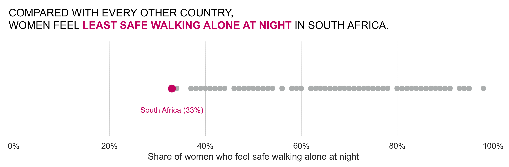

### DAY 2. How many women experience physical or sexual violence?

Perceptions aren’t just “feelings”, they’re grounded in high levels of actual violence against women.

  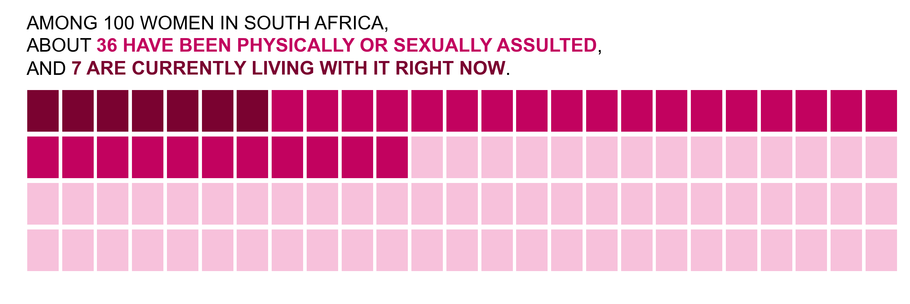

### DAY 3. What kinds of sexual offences are most often reported?

When cases do reach the police, it’s usually for the most extreme forms of abuse. Rape dominates the pattern of recorded sexual offences.

  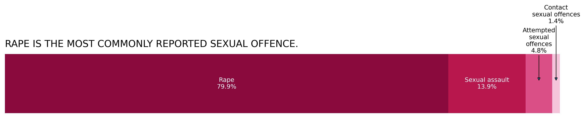

### DAY 4. Are some women more at risk of violence?

Not all women face the same level of risk. Women with disabilities are disproportionately affected by intimate partner violence.

  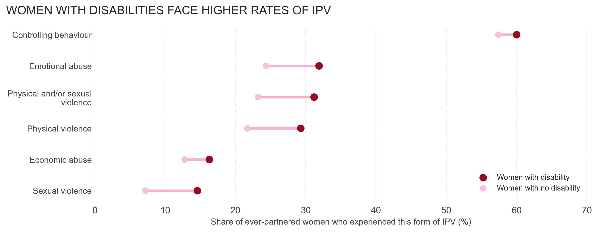

## From everyday danger to deadly violence

The same patterns of control, fear and abuse that shape women’s daily lives also end in death. The next set of visuals looks at femicide (the killing of women) and how it has changed over time.

### DAY 5. How often are women murdered in South Africa?

  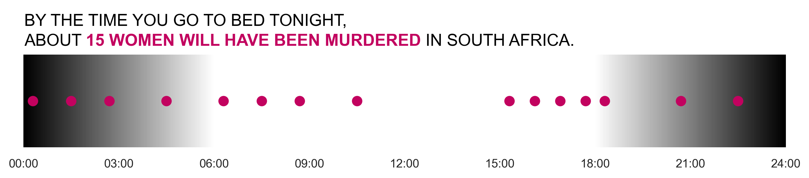

### DAY 6. Who is killing our women?

The stereotype of “stranger danger” doesn’t match reality. Most women are killed by people they know, often intimate partners.

  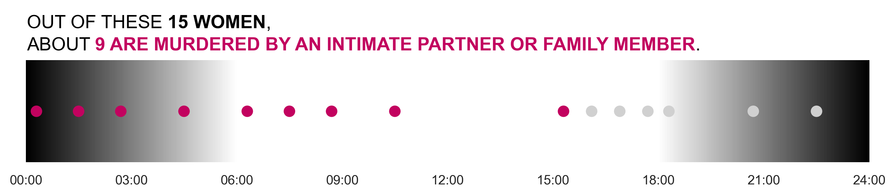

### DAY 7. Femicide trends over time

Looking at trends over time shows that while non-partner femicide has fallen, intimate partner femicide remains high on the global scale and has started to rise again.

  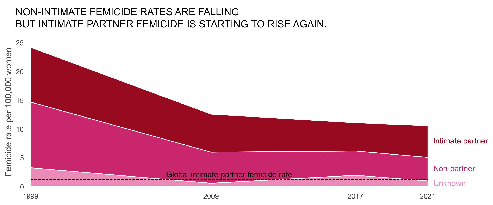

### DAY 8. How are women killed?

Understanding *how* women are killed – firearms, stabbing, beating and other methods, matters for prevention and policy responses.

  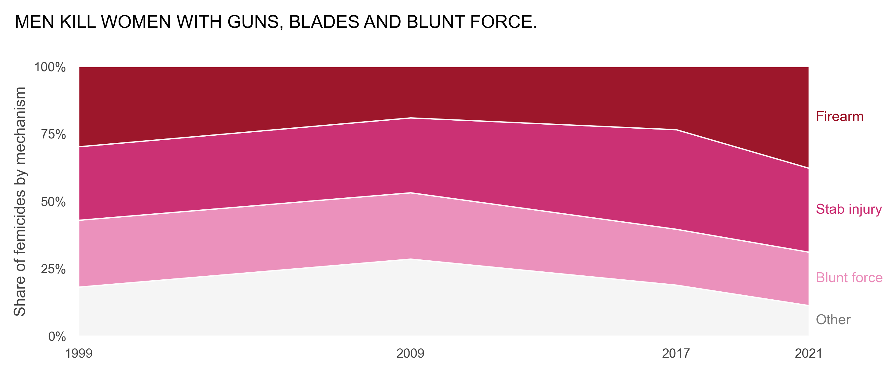

### DAY 9. How often is femicide linked to rape?

Rape and femicide are deeply intertwined. Rape-related femicides are more common in killings by non-partners than in intimate partner femicides.

  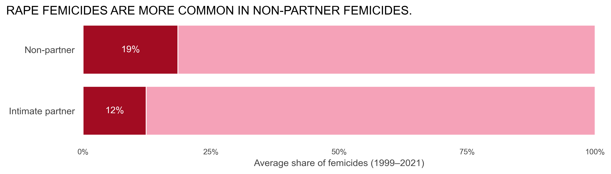

## Where violence happens and how systems respond

Violence against women is widespread across South Africa, but the chances of finding help or justice vary sharply by place. The next visuals zoom in on provinces, services and missed warning signs.

### DAY 10. Where in South Africa are sexual offences most frequently reported?

When we adjust police data for the number of women in each province, smaller provinces like the Northern Cape and Free State suddenly jump to the top of the list for recorded sexual offences per 100,000 women.

 
   

This roughly echoes the national GBV survey, which also finds that violence against women is widespread across provinces, with particularly high burdens in smaller and poorer regions. But there’s also a mismatch: in provinces like Gauteng and KwaZulu-Natal, many women report violence in surveys, yet the rate of recorded sexual offences per woman is only middle-of-the-pack, a sign of under-reporting and barriers to police.

### DAY 11. How overloaded are specialised rape services?

Access to specialised services is uneven. Some provinces have extremely high loads per Thuthuzela Care Centre (TCC), stretching the system and limiting the support survivors can receive.

 
   

### DAY 12. How often was intimate partner violence known before a femicide?

Many femicides do not come “out of nowhere”. In a large share of intimate partner femicides, there was prior violence that had already been reported to the police.

 
 

### DAY 13. What happens to rape cases as they move through the system?

From the moment a rape occurs, most cases fall out of the system long before they ever see a courtroom.

  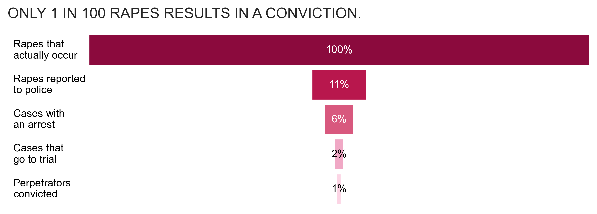

### DAY 14. How often are killers and rapists actually convicted?

For the few cases that do make it through the system, conviction is still not guaranteed, underscoring how high impunity remains, both for rape and for femicide.

  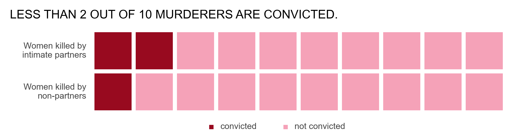

### DAY 15. Why don’t many survivors report rape to the police?

Survivors themselves explain why they don’t report. Fear of reprisals, embarrassment and lack of faith that police will solve the crime are among the main reasons.

 
   

### DAY 16. What are the experiences of women who do report?

Reporting is only the first step. Survivors describe long waiting times, insensitive treatment, and a lack of information on rights and available services – experiences that inhibit access to justice and support.

 
   

If you or someone you know is feeling unsafe, you can find help and support by visiting: **[lila.help](https://lila.help)** – a global directory of specialised services in your country.

## References

[1] Gallup. Global Law and Order 2023. Gallup, Inc. (Indicator: “Feel safe walking alone at night” for South Africa and comparison countries.)

[2] Human Sciences Research Council (HSRC) & Department of Women, Youth and Persons with Disabilities. National Gender-Based Violence (GBV) Prevalence Study, South Africa. Pretoria, Government of South Africa.

[3] South African Police Service (SAPS). Crime Situation in South Africa, 4th Quarter 2023/2024. Pretoria, SAPS. (Sexual offences by category at national level.)

[4] Human Sciences Research Council (HSRC) & Department of Women, Youth and Persons with Disabilities. National Gender-Based Violence (GBV) Prevalence Study, South Africa. (Disability status and intimate partner violence breakdowns.)

[5] South African Police Service (SAPS). Crime Situation in South Africa, 2023/2024 (murder of women); and Statistics South Africa. Mid-year Population Estimates 2023 (female population by age and sex). Combined to estimate “women murdered per day”.

[6] Abrahams, N., Mathews, S., Martin, L. J., Lombard, C., & Jewkes, R. Intimate partner femicide in South Africa in 1999 and 2009. (National femicide studies used for perpetrator relationship patterns.)

[7] Abrahams, N., Mathews, S., Martin, L. J., Lombard, C., & Jewkes, R. Intimate partner femicide in South Africa in 1999 and 2009; and Stöckl, H. et al. The global prevalence of intimate partner homicide: a systematic review. Used to compare trends in intimate partner vs non-partner femicide.

[8] Abrahams, N., Mathews, S., Lombard, C., Martin, L. J., & Jewkes, R. National femicide study datasets (1999 and 2009), analysing mechanisms of injury (firearms, stabbing, blunt force, other).

[9] Mathews, S., Abrahams, N., Martin, L. J., Lombard, C., & Jewkes, R. Analyses of rape-related femicides in South Africa (intimate partner vs non-partner femicide) from the national femicide studies.

[10] South African Police Service (SAPS). Crime Situation in South Africa, 2023/2024 (rape, sexual assault, attempted and contact sexual offences by province); and Statistics South Africa. Mid-year Population Estimates 2023 (female population by province). Used to calculate sexual offences per 100,000 women.

[11] National Prosecuting Authority (NPA) of South Africa. Thuthuzela Care Centres (TCC) Network and Performance Statistics, 2023/2024. Combined with SAPS rape counts by province to estimate rape cases per TCC.

[12] Mathews, S., Abrahams, N., Martin, L. J., Lombard, C., & Jewkes, R. National femicide studies in South Africa (1999 and 2009) – modules on prior police knowledge of intimate partner violence before femicide.

[13] Clooney Foundation for Justice. Barriers to Justice: Gender-Based Violence in South Africa (2025). Sections on case pathways and attrition from rape to reporting, investigation and trial.

[14] Clooney Foundation for Justice. Barriers to Justice: Gender-Based Violence in South Africa (2025). Analysis of conviction outcomes for rape and femicide cases that reach the end of the justice process.

[15] Clooney Foundation for Justice. Barriers to Justice: Gender-Based Violence in South Africa (2025). Survey findings on reasons why survivors do not report rape to the police.

[16] Clooney Foundation for Justice. Barriers to Justice: Gender-Based Violence in South Africa (2025). Survey findings on survivors’ experiences after reporting (waiting times, insensitive treatment, lack of information on rights and services). 
