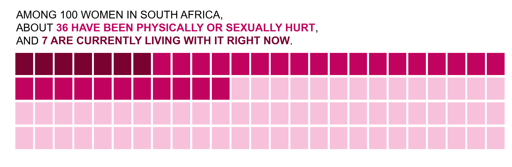
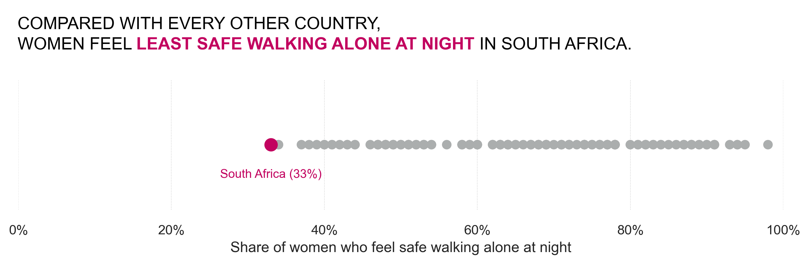
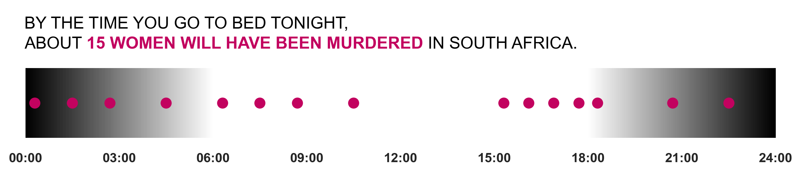
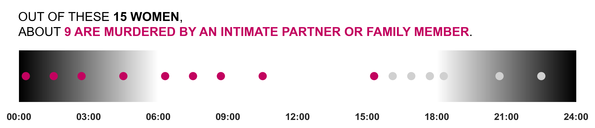
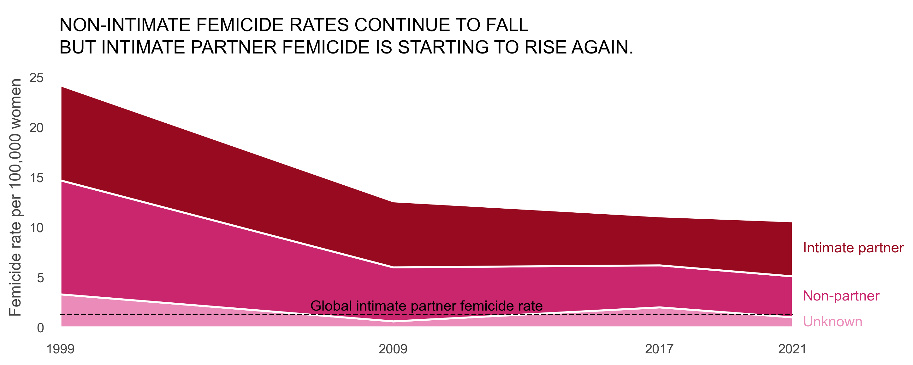
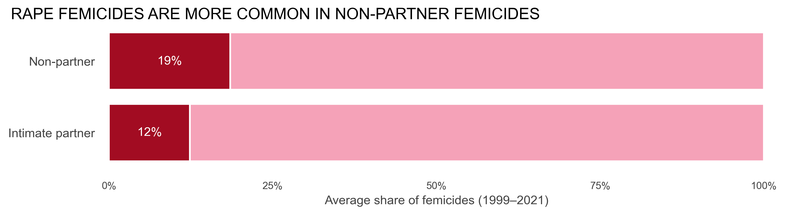

# A Not So Friendly Reminder
### A visual documentation of the state of Gender-Based Violence and Femicide in South Africa for the 16 Days of Activism

On 21 November 2025, thousands of women South Africa took to the streets. Gender-Based Violence and Femicide (GBVF) a national emergency

## HOW BIG IS THE CRISIS?

### Day 1 — How many women are living with violence?

  

*Among 100 women in South Africa, about 36 have been physically or sexually hurt, and 7 are currently living with it right now.*  
Source: [1]

### Day 2 – How safe does South Africa feel compared to everywhere else?

  

*Compared with every other country Gallup surveys, women in South Africa are the least likely to say they feel safe walking alone at night.*  
Source: [3]

### Day 3 – How many women are being murdered daily?

  

South Africa’s intimate partner femicide rate – **5.5 women per 100,000** – is about **five times the global average**.  
On an ‘average’ day, around **15 women are murdered**, roughly one every 1.6 hours.  
Source: [2]

### Day 4 – Who is murdering our women?

  

Out of these 15 women, **about 9 are killed by an intimate partner or a family member**.

Femicide in South Africa is not evenly distributed. It hits **younger women**, **African women**, and women in certain provinces – especially **Eastern Cape** and **Gauteng** – much harder.  

When a woman is killed in South Africa, chances are high her killer will never be held accountable.  
In 2020/21, fewer than **1 in 5** intimate partner killers and about **1 in 8** non-partner killers were convicted.  
Source: [2]

### Day 5 – Has it always been this bad?

  

Between 1999 and 2009, South Africa **dramatically reduced femicide**.  

But in the last decade, progress has stalled – and **intimate partner femicide is rising again**, even as overall femicide stays high by global standards.  
Source: [2]

### Day 6 – How often does murder also involve rape?

  

### Day 7 – What turns violence into murder?

  

### Day 8 – When a woman is murdered, how often is anyone convicted??

  

Day 9 – How often was the violence already known before she was killed?

---

If you or someone you know is feeling unsafe, you can find help and support by visiting: **[lila.help](https://lila.help)** – a global directory of specialised services in your country.

---

## References

[1] *The First South African National Gender-Based Violence Study*, 2022.  
[2] Abrahams, N., Chirwa, E., Mhlongo, S., Dekel, B., Ketelo, A., Lombard, C., … Jewkes, R. (2025). *Two decades of tracking femicide in South Africa: An analysis of four national surveys from 1999 to 2020/2021.* Global Public Health, 20(1). https://doi.org/10.1080/17441692.2025.2576753  
[3] *The Global Safety Report – A Safer World in Unsafe Times?* Gallup.  
[4] (Add any additional sources you decide to use here.)
